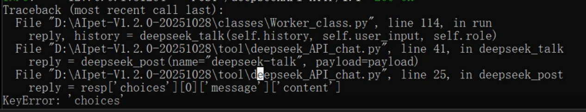

# AIpet - 丛雨AI桌宠

# 本项目仅供学习交流使用，所使用的所有数据均归YuzuSoft所有
# 本项目严格禁止用于任何商业用途

## 📖 项目简介

一个基于AI的桌面宠物应用，灵感来自丛雨角色。本项目参考了原项目MurasamePet，进行部分重构和重写，并根据GPL-3.0许可证要求进行开源。

## 最新版本咨询

#### 1.2.1 将支持长期记忆与立绘大小调整，优化一键运行
## 🔗 原项目指路

- **演示&教程视频**: [Bilibili 视频](https://www.bilibili.com/video/BV1F6ykBwEDu)
- **GitHub 项目**: [LemonQu-GIT/MurasamePet](https://github.com/LemonQu-GIT/MurasamePet?tab=readme-ov-file)

## 🚀 快速开始
### V1.2.0版本支持一键部署与运行
### [教程视频](https://www.bilibili.com/video/BV1vjeGzfE1w)
### 环境准备

#### 1. 创建虚拟环境
安装anaconda配置环境[anaconda官网](https://www.anaconda.com/download)（如果你用其他的虚拟环境也可以）


#### 2. 安装Ollama（可选）
项目里支持deepseek的API调用，需要自己获取并填入APIkey.json
在 https://ollama.com/download 下载 Ollama 并安装
```bash
ollama pull qwen3:14b
ollama pull qwen2.5vl:7b #如果需要屏幕识别
```
~~（注意：本地必须跑一个微调的qwen3-14b模型作为对话模型，其他辅助模型可由deepseek担任）~~

V1.0.1版本支持除了语音合成，全部AI跑在云端deepseek，相应的download.py也会检查配置文件，若是"deepseek"则不会下载对话模型，想要后面跑在本地的需要修改配置后再下载一次

V1.1.0版本支持屏幕识别，只支持跑在本地qwen2.5vl模型上，可以在配置文件设置此选项的开关


#### 3. 部署 GPT-SoVITS
https://github.com/RVC-Boss/GPT-SoVITS

下载整合包，更方便：https://www.yuque.com/baicaigongchang1145haoyuangong/ib3g1e/dkxgpiy9zb96hob4
（我用的GPT-SoVITS-v2pro-20250604-nvidia50，你们看显卡兼容）
##### 配置模型文件
将刚刚下好的项目解压，将其中整个GPT-SoVITS文件夹放入AIpet-Murasame目录下（与tool和classes这些文件并列）
将"GPT-SoVITS-...-......-......"重命名为"GPT-SoVITS"

#### 4. 一键安装环境

直接执行env.bat即可
##### 手动安装
1. 创建conda环境
```bash
conda create -n AIpet_env python=3.10
```
2. 安装依赖
```bash
conda activate AIpet_env  #激活环境
pip install torch torchvision --index-url https://download.pytorch.org/whl/cu130   #Pytorch 其实不在本地跑模型不用装
cd /d 你的项目地址
pip -r requirements.txt   #安装依赖
python download.py   #下模型
```
### 开始运行

#### 直接执行start_ai_pet.bat

#### 手动启动
1. 启动桌宠本体(在项目目录启动)
```bash
conda activate AIpet_env
python main.py
```
2. 启动TTS
```bash
cd /d 项目地址/GPT-SoVITS
"项目地址/GPT-SoVITS/runtime/python.exe" api_v2.py
```

3. 开始互动

### 过程中
点击丛雨下半部分可以输入内容，鼠标中建按住可以调整位置，长按鼠标按住丛雨的头部并左右移动可以摸头……

### 配置文件
``` json
{
  "local_api": {              #本地api端口，如果远程部署自己改地址
    "ollama": "http://localhost:28565/ollama",
    "qwen3_lora": "http://localhost:28565/qwen3-lora",
    "gpt_sovits_tts": "http://localhost:28565/tts",
    "deepseek_api": "http://localhost:28565/deepseekAPI"
  },
  "portrait": "a",            #立绘模式，可以改为b
  "user_name": "Kuxw",        #用户名字
  "model_type": "deepseek",   #模型类型，local为本地模型
  "screen_type": "false",     #屏幕识别开关
  "DEFAULT_PORTRAIT_SCREEN_RATIO": 0.8    #桌宠高度最多占屏幕高度的多少
}
```

If you like, i want a little star.


## 💬 常见问题（Q&A）

### 1️⃣ GPU不可用  
> **问题：** 有显卡但 TTS 运行时提示  
> `Warning: CUDA is not available, set device to CPU.`  
> **解决：** 更新显卡驱动，确保 CUDA 与 PyTorch 匹配。  

---

### 2️⃣ SoVITS 响应慢  
> **问题：** SoVITS 有反应但速度极慢。  
> **解决：** 请下载与你显卡对应的版本：  
> -  50 系列：使用 **专用版本**  
> -  40 系及以下：使用 **通用版本**

---

### 3️⃣ Conda 激活错误  
> **问题：** `CondaError: Run 'conda init' before 'conda activate'`  
> **解决：**  
> - 建议使用 **Miniconda** 而非完整版；  
> - 或在命令行中手动执行：  
>   ```bash
>   conda init
>   ```

---

### 4️⃣ API Key 报错  
  
> **问题：** 启动时如图，API 无法使用。  
> **解决：**  
> - 检查 **API Key 是否有效、账户余额是否充足**；  
> - 若文件编码问题，重新保存为 **ANSI 编码**。

---

### 5️⃣ `start_ai_pet.bat` 闪退  
> **问题：** 双击启动脚本后直接关闭窗口。  
> **解决：**  
> - 确保路径中 **没有特殊符号或空格**。  
>   （如中文名、括号、感叹号等）

---

### 6️⃣ 脚本乱码或闪退  
> **问题：** `env.bat` 或 `start_ai_pet.bat` 乱码、无法运行。  
> **解决：**  
> - 重新保存为 **ANSI 编码格式**。  

---

## 开发任务

| 状态 | 任务 |
|:--:|:--|
| ✅ | 长期记忆功能 |
|  | 全部模型改用 Qwen 系列 |
| ✅ | 桌宠显示大小写入配置文件 |
| ✅ | 添加 Q&A 支持，解决部分常见问题 |
|  | tts尝试部署到阿里云 |
|  | python脚本一键启动，兼容性更高，优化依赖（避免强制下载 PyTorch） |
|  | 检查“置顶逻辑”，确保游戏中始终保持窗口置顶 |
|  | 完成完善的日志记录 |

