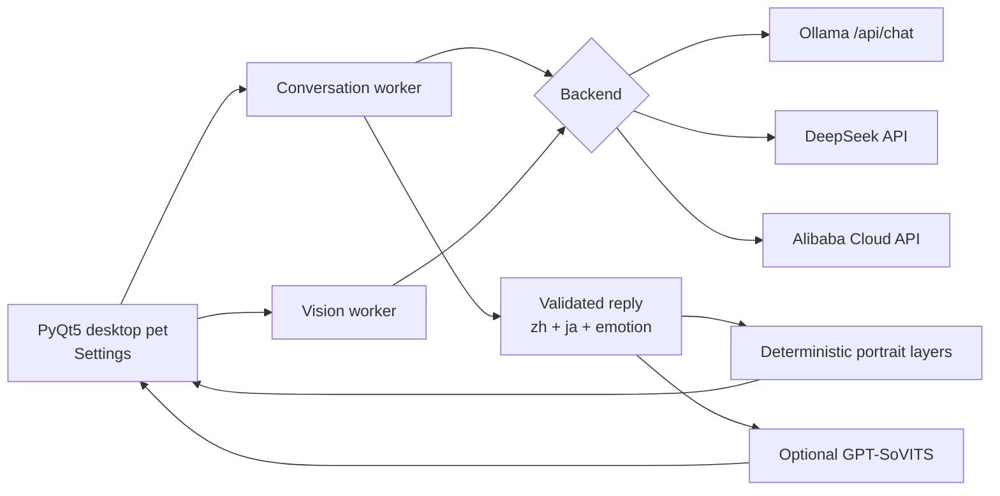

<p align="center">
  
</p>

<h1 align="center">AIpet · Murasame</h1>

<p align="center">
  <strong>A prompt-driven AI desktop companion with interchangeable local and cloud models.</strong>
</p>

<p align="center">
  
  
  
  
  
  <a href="LICENSE"></a>
</p>

<p align="center">
  <a href="https://github.com/kuxiaowo/AIpet-Murasame/stargazers"></a>
  <a href="https://github.com/kuxiaowo/AIpet-Murasame/commits/main"></a>
  <a href="https://github.com/kuxiaowo/AIpet-Murasame/network/members"></a>
</p>

<p align="center">
  <strong>English</strong> | <a href="docs/zh-CN/README.md">简体中文</a>
</p>

<p align="center">
  <a href="#quick-start"></a>
  <a href="#settings"></a>
  <a href="#architecture"></a>
</p>

---

## Overview

AIpet is an always-on-top Murasame desktop companion for Windows. The character is simulated entirely through a personality prompt—there is no bundled chat Transformer, LoRA adapter, PyTorch runtime, or model download script.

You can run conversations through a local [Ollama](https://ollama.com/) service or an OpenAI-compatible cloud API. DeepSeek and Alibaba Cloud Model Studio are built in, while the backend boundary stays small enough to extend.

## Highlights

- **Two backend modes** — local Ollama or a cloud API.
- **Selectable models** — configure chat and vision models independently.
- **Built-in providers** — DeepSeek for chat and Alibaba Cloud for chat plus vision.
- **Bilingual settings** — switch between English and Simplified Chinese instantly, choose backends, load model lists, edit the personality prompt, and configure behavior without hand-editing JSON.
- **Stable character output** — each response uses validated structured JSON with Chinese text, Japanese TTS text, and one of six emotions.
- **Deterministic portraits** — emotions map to known portrait layers in code; model changes cannot invent broken layer IDs.
- **Optional screen awareness** — screenshots are captured safely in the Qt GUI thread, then analyzed in the background.
- **Optional speech** — GPT-SoVITS-compatible output and faster-whisper Caps Lock input.
- **Private user state** — configuration, keys, and conversation history live outside the Git repository.

## Supported backends

| Mode | Provider | Chat | Vision | Default chat model | Default vision model |
|---|---|:---:|:---:|---|---|
| Ollama | Any compatible local model | ✓ | ✓ | `qwen3:14b` | `qwen2.5vl:7b` |
| API | DeepSeek | ✓ | — | `deepseek-v4-flash` | — |
| API | Alibaba Cloud Model Studio | ✓ | ✓ | `qwen-plus` | `qwen3-vl-plus` |

Model fields are editable. The defaults are starting points, not hard-coded requirements.

## Architecture


```mermaid
flowchart LR
    UI["PyQt5 desktop pet<br>Settings"] --> C["Conversation worker"]
    UI --> V["Vision worker"]
    C --> B{"Backend"}
    V --> B
    B --> O["Ollama /api/chat"]
    B --> D["DeepSeek API"]
    B --> A["Alibaba Cloud API"]
    C --> R["Validated reply<br>zh + ja + emotion"]
    R --> P["Deterministic portrait layers"]
    R --> T["Optional GPT-SoVITS"]
    P --> UI
    T --> UI
```

The language model never controls files, Qt widgets, portrait layer IDs, or shell commands. Screen text is wrapped as untrusted event context before it reaches the character prompt.

## Requirements

- Windows 10 or 11
- Conda
- Python 3.10 or newer
- One of:
  - [Ollama](https://ollama.com/) with a chat model
  - a DeepSeek API key
  - an Alibaba Cloud Model Studio API key
- Optional: GPT-SoVITS for speech output; AIpet can manage the local service
- Optional: microphone dependencies from `requirements-voice.txt`

A local NVIDIA GPU is not required by AIpet itself. Hardware needs depend on the Ollama and TTS models you choose.

## Quick start

### 1. Clone the project

```bash
git clone https://github.com/kuxiaowo/AIpet-Murasame.git
cd AIpet-Murasame
```

### 2. Create the Conda environment

```bash
conda env create -f environment.yml
conda activate aipet
```

Or create it manually:

```bash
conda create -n aipet python=3.10 -y
conda activate aipet
python -m pip install -r requirements.txt
```

For optional Caps Lock speech input:

```bash
python -m pip install -r requirements-voice.txt
```

### 3. Prepare a backend

For Ollama, install it and pull models of your choice. For example:

```bash
ollama pull qwen3:14b
ollama pull qwen2.5vl:7b
```

For a cloud API, have a DeepSeek or Alibaba Cloud key ready. Keys may also be provided through environment variables:

```powershell
$env:DEEPSEEK_API_KEY = "your-key"
$env:DASHSCOPE_API_KEY = "your-key"
```

### 4. Launch

```bash
python run.py
```

Settings opens on first launch. Save a valid configuration and AIpet starts immediately. The launcher does not install packages or modify CUDA. Model downloads start only after an explicit Whisper download action or approval of the TTS model prompt. A downloaded local GPT-SoVITS service starts on demand before the first TTS request, or from the manual control in Settings.

## Settings

Open **Settings…** from the tray menu at any time.

### Models

- Switch between Ollama and API mode.
- Select DeepSeek or Alibaba Cloud.
- Edit server URLs and timeout values.
- Select separate chat and vision models.
- Enable or disable DeepSeek V4 thinking mode.
- Select a built-in faster-whisper model, check its local status, and download it with in-card byte progress.
- Switch the settings and tray UI between English and Simplified Chinese.
- Limit Ollama's context window to avoid unexpectedly large model allocations.
- Test the connection and populate model lists from the selected service.

The model loader calls Ollama's `GET /api/tags` or the cloud provider's `GET /models`. Every model selector remains editable, so custom IDs still work when an endpoint omits a model or model listing is unavailable.

DeepSeek V4 uses the current `deepseek-v4-flash` and `deepseek-v4-pro` IDs. Retired `deepseek-chat` and `deepseek-reasoner` settings are migrated automatically. DeepSeek is intentionally chat-only in the current integration; screen vision is available with Ollama or Alibaba Cloud.

### Character

- Set the user name and portrait set.
- Create or edit the personality prompt visually.
- Import a UTF-8 text or Markdown prompt.

AIpet adds the structured response contract automatically. The personality file only needs to describe identity, tone, relationships, and boundaries.

### Automation

- Enable periodic screen vision and choose its interval.
- Locate a local GPT-SoVITS installation, validate the Murasame voice weights and references, and check whether the service is online.
- Download missing Murasame GPT/SoVITS weights with resumable in-card progress after accepting the model notice.
- Configure optional faster-whisper input.
- Select a display, portrait scale, idle thresholds, and history size.

## Data and API keys

On Windows, user data is stored under:

```text
%APPDATA%\AIpet-Murasame\
├── config.json
├── history.json
└── personality.txt
```

Temporary audio and screenshots use `%LOCALAPPDATA%\AIpet-Murasame\cache`; managed Whisper and TTS models use `%LOCALAPPDATA%\AIpet-Murasame\models`.

API keys entered in Settings are stored in the user configuration. For better separation, leave those fields blank and use `DEEPSEEK_API_KEY` or `DASHSCOPE_API_KEY`. Runtime files and secrets are ignored by Git.

Screen vision is disabled by default. When enabled, screenshots are sent only to the vision backend selected in Settings.

## GPT-SoVITS

AIpet calls a GPT-SoVITS-compatible endpoint directly; the default is:

```text
http://127.0.0.1:9880/tts
```

The six reference categories are `平静`, `高兴`, `害羞`, `生气`, `惊讶`, and `着急`. If GPT-SoVITS runs on another machine, set **Remote reference root** to the path that server uses for this repository's `reference_voices` directory.

For a loopback endpoint, AIpet checks the configured engine directory, `GPT_SOVITS_HOME`, and a small set of nearby installation locations. If GPT-SoVITS is not detected, AIpet reads the NVIDIA GPU name and downloads the RTX 50-series package or the general Windows package as appropriate. The Settings card reports preparation, verification, download, extraction, installation, and cleanup separately. Extraction prefers native 7-Zip with multithreading enabled and falls back to Windows bsdtar; installation uses a same-volume atomic move instead of copying the extracted tree. Downloads do not open browser pages. Missing character weights come from `LemonQu/Murasame_SoVITS`, while reference voices come from `kuxiaowo/Murasame-tts-reference-voice`.

When a local TTS request arrives and the API is offline, AIpet starts `api_v2.py` with the engine's bundled Python runtime, waits for its OpenAPI endpoint, loads the configured character weights, and then sends the synthesis request. Settings also provides manual start and stop controls with visible startup stages. Duplicate launches are serialized, and AIpet only stops a process it started itself. Remote endpoints are health-checked but never launched or stopped locally.

TTS failures do not discard a model response: AIpet still displays the text and shows the speech error through the tray.

## Controls

| Action | Control |
|---|---|
| Type a message | Left-click the lower part of the character, type, then press Enter |
| Cancel input | Press Escape |
| Pat her head | Hold the left mouse button over her head and move horizontally |
| Move the pet | Drag with the middle mouse button |
| Talk | Hold Caps Lock for two seconds when optional speech input is enabled |
| Settings, vision, DND, memory, exit | Use the system tray menu |

## Development

Run the test suite in the Conda environment:

```bash
$env:QT_QPA_PLATFORM = "offscreen"
python -m unittest discover -s tests -v
```

The tests cover configuration validation, storage, structured responses, provider payloads, portrait composition, prompt-injection boundaries, and an offscreen Qt construction smoke test.

Main modules:

```text
classes/
├── murasame_class.py   # Qt interaction, playback, idle and screen events
└── workers.py          # Background conversation and vision work
tool/
├── backends.py         # Ollama and OpenAI-compatible API adapters
├── config.py           # Validated user settings
├── portraits.py        # Emotion-to-layer mapping
├── storage.py          # Conversation persistence
├── tts.py              # GPT-SoVITS client
└── tts_service.py      # Managed local GPT-SoVITS process
ui/
└── settings_dialog.py  # Visual configuration and prompt editor
```

## Known limitations

- Desktop behavior is designed and tested primarily for Windows.
- DeepSeek screen vision is not enabled because this integration only targets its chat API.
- Network cancellation is cooperative: an interrupted HTTP request may finish in the background, but stale results are ignored.
- Character artwork and voice assets can have terms different from the source-code license.

## License and asset notice

Source code is distributed under the [GNU Affero General Public License v3.0](LICENSE).

This is an unofficial fan project for study and technical exchange. Murasame and the included third-party artwork, voice data, and related assets belong to their respective rights holders, including YUZUSOFT, and are not relicensed by the AGPL. Do not use those assets commercially without permission.

If AIpet made your desktop a little less lonely, consider leaving a ⭐.
