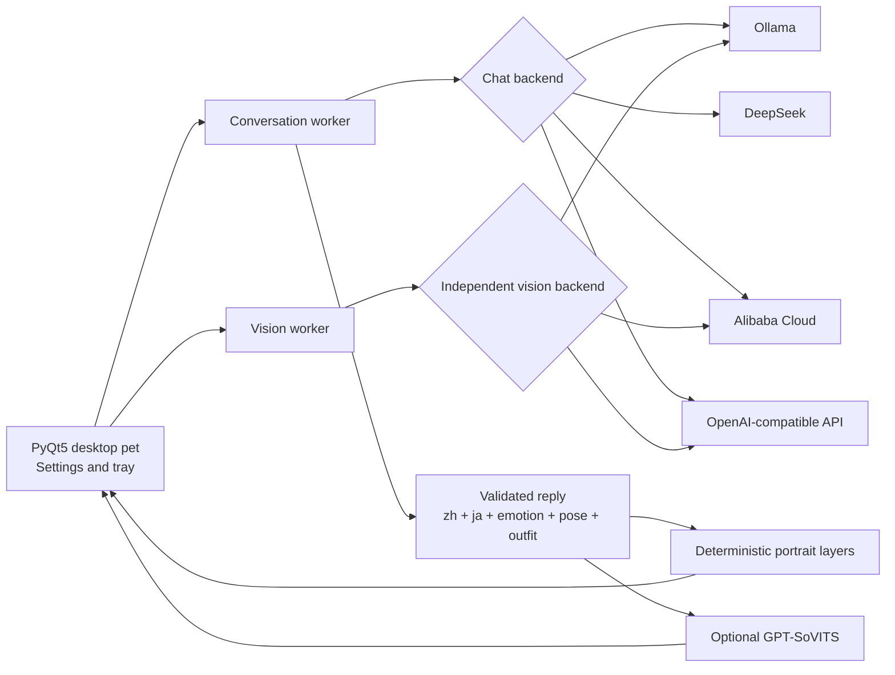

<p align="center">
  
</p>

<h1 align="center">AIpet · Murasame</h1>

<p align="center">
  <strong>A prompt-driven AI desktop companion with interchangeable local and cloud models.</strong>
</p>

<p align="center">
  
  
  
  
  
  <a href="LICENSE"></a>
</p>

<p align="center">
  <a href="https://github.com/kuxiaowo/AIpet-Murasame/stargazers"></a>
  <a href="https://space.bilibili.com/1067030066"></a>
</p>

<p align="center">
  <strong>English</strong> | <a href="docs/zh-CN/README.md">简体中文</a>
</p>

---

## About this project

AIpet is an always-on-top Murasame desktop companion for Windows. It combines
a transparent PyQt5 character window with a configurable local or cloud
language model, optional screen awareness, GPT-SoVITS speech output, and
faster-whisper speech input.

The character personality is driven by a prompt. AIpet does not bundle a chat
Transformer, LoRA adapter, or general-purpose shell agent. Models return a
validated character response; the application itself controls portrait layers,
files, windows, downloads, and subprocesses.

This project is based on
[LemonQu-GIT/MurasamePet](https://github.com/LemonQu-GIT/MurasamePet).
Demonstrations, deployment videos, and project updates are published on the
[author's Bilibili profile](https://space.bilibili.com/1067030066).

If AIpet is useful or you enjoy having Murasame on your desktop, please consider
giving the repository a [Star ⭐](https://github.com/kuxiaowo/AIpet-Murasame/stargazers).

## Deployment

The current release is deployed from source. Windows 10 and Windows 11 are the
primary supported systems.

### 1. Requirements

Install the following before starting:

- [Git](https://git-scm.com/)
- [Conda](https://docs.conda.io/) or Miniconda
- Python 3.10 through the supplied Conda environment
- One conversation backend:
  - [Ollama](https://ollama.com/) for local models, or
  - a DeepSeek, Alibaba Cloud Model Studio, or OpenAI-compatible API

Optional components:

- An NVIDIA GPU for larger local Ollama or GPT-SoVITS workloads
- A microphone for Caps Lock speech input
- 7-Zip for faster local GPT-SoVITS extraction; Windows `tar` is used as a
  fallback
- An AutoDL instance if speech synthesis should run in the cloud

AIpet itself does not require CUDA when chat, vision, and TTS all use remote
services.

### 2. Clone the repository

```bash
git clone https://github.com/kuxiaowo/AIpet-Murasame.git
cd AIpet-Murasame
```

### 3. Create the Conda environment

The recommended method uses the checked-in environment definition:

```bash
conda env create -f environment.yml
conda activate aipet
```

The equivalent manual setup is:

```bash
conda create -n aipet python=3.10 -y
conda activate aipet
python -m pip install -r requirements.txt
```

The base requirements contain the desktop UI, settings validation, HTTP, SSH,
image processing, and model integration libraries. They do not install a large
chat model or PyTorch into the AIpet environment.

### 4. Prepare a conversation backend

#### Option A: local Ollama

Install Ollama, start its service, and pull a chat model. Pulling the example
vision model is optional:

```bash
ollama pull qwen3:14b
ollama pull qwen2.5vl:7b
```

The default Ollama address is `http://127.0.0.1:11434`. Model fields remain
editable, so compatible custom model IDs can be used.

#### Option B: cloud API

Prepare a key for DeepSeek, Alibaba Cloud Model Studio, or an OpenAI-compatible
service. Keys may be entered in Settings or supplied through environment
variables:

```powershell
$env:DEEPSEEK_API_KEY = "your-key"
$env:DASHSCOPE_API_KEY = "your-key"
$env:OPENAI_API_KEY = "your-key"
```

Chat and vision credentials are configured independently. A cloud chat model
may therefore be combined with a local Ollama vision model.

### 5. Start AIpet

```bash
python main.py
```

On the first launch, AIpet opens the initial Settings window. At minimum:

1. Select **Ollama** or **Cloud API** under **Language models**.
2. Enter the server address, provider, API key, and model as required.
3. Set the user name and review the personality prompt under **Character**.
4. Keep screen vision, TTS, and speech input disabled until their optional
   dependencies are ready.
5. Save the settings.

After configuration, Murasame appears as a transparent desktop window and the
AIpet icon appears in the system tray. Settings can be reopened from the tray
at any time.

The launcher does not silently install dependencies or modify CUDA. Whisper
downloads begin only after the user presses Download, and GPT-SoVITS downloads
require confirmation.

### 6. Optional Caps Lock speech input

Install the additional recording and faster-whisper dependencies:

```bash
python -m pip install -r requirements-voice.txt
```

Then enable speech input under **Settings → Extensions**, select a model
directory and recording device, and download the model if it is not already
present.

### 7. Updating an older installation

Back up these files before moving from the old V1.3.2 architecture:

```text
config.json
data/history.json
reference_voices/
GPT-SoVITS/
```

The refactored application stores user data outside the repository and uses a
new settings schema. Automatic import of every old field and history format is
not yet complete, so a fresh Settings pass is currently the safest upgrade
path.

## Features

### Local and cloud conversations

| Purpose | Provider | Default model |
|---|---|---|
| Chat | Ollama | `qwen3:14b` |
| Chat | DeepSeek | `deepseek-v4-flash` |
| Chat | Alibaba Cloud Model Studio | `qwen-plus` |
| Chat | OpenAI-compatible API | `gpt-5.6-luna` |
| Vision | Ollama | `qwen2.5vl:7b` |
| Vision | Alibaba Cloud Model Studio | `qwen3-vl-plus` |
| Vision | OpenAI-compatible API | `gpt-5.6-luna` |

Model names, endpoints, timeouts, and the Ollama context window can all be
changed in Settings. AIpet loads model lists from Ollama's `GET /api/tags` or
the provider's OpenAI-compatible `GET /models` endpoint, while preserving
manual entry for custom IDs.

Character replies use validated JSON containing:

- one to three Simplified Chinese display sentences;
- corresponding Japanese text for TTS;
- one of six supported emotions;
- an `a` or `b` portrait pose;
- one of four outfits.

Invalid, blank, or out-of-range model replies are rejected instead of being
passed directly into the UI.

### Desktop interaction and reliable topmost behavior

The pet window is transparent, frameless, omitted from the normal taskbar, and
kept above ordinary windows. On Windows, AIpet supplements Qt's topmost flag
with a native non-activating `SetWindowPos(HWND_TOPMOST)` watchdog. It reasserts
the state after window lifecycle changes and every two seconds without moving
the window or stealing keyboard focus.

| Action | Control |
|---|---|
| Type a message | Left-click the lower part of the character, type, then press Enter |
| Cancel input | Press Escape |
| Pat her head | Hold the left mouse button over her head and move horizontally |
| Move the pet | Drag with the middle mouse button |
| Talk | Hold Caps Lock for two seconds when speech input is enabled |
| Settings, vision, DND, memory, exit | Use the system tray menu |

Dragging the pet to another monitor updates the selected display and adapts the
portrait height to that monitor's available area.

### Personality, portraits, and outfits

The **Character** page provides:

- user-name configuration;
- two portrait pose sets;
- sleepwear, casual clothes, school uniform, and purple kimono;
- a visual personality-prompt editor;
- UTF-8 text or Markdown prompt import.

The model selects only validated pose, emotion, and outfit names. AIpet maps
those values to known artwork layers, so changing providers cannot invent
arbitrary layer IDs or corrupt portrait composition.

### Screen awareness

Screen vision is disabled by default. When enabled:

1. Qt captures the selected display in the GUI thread.
2. Near-identical frames are discarded locally.
3. A background worker sends meaningful changes to the selected vision
   backend.
4. The result is validated and summarized before it can trigger a response.

The vision backend is independent from chat. AIpet treats an on-screen Murasame
as its own desktop image rather than another speaker. Raw screenshots are
temporary files and are not stored in conversation history.

### Conversation memory and automatic behavior

AIpet persists bounded conversation history and compact screen-event summaries.
It keeps at most 12 significant screen events, removes consecutive duplicates,
and injects at most 8 recent events within a character budget.

Automatic behavior includes:

- a configurable quiet/thinking reminder;
- an away reminder;
- a welcome-back reaction after the user returns;
- a shared cooldown that prevents repeated proactive interruptions;
- a persistent Do Not Disturb mode.

The **Other** settings page can clear conversation/screen memory or cached
screenshots, generated speech, and recordings after confirmation.

### Local GPT-SoVITS speech output

Speech output uses the
[RVC-Boss/GPT-SoVITS](https://github.com/RVC-Boss/GPT-SoVITS)
API format. The default endpoint is:

```text
http://127.0.0.1:9880/tts
```

Under **Settings → Extensions**, enable TTS and select **Local computer**.
Configure:

- the GPT-SoVITS engine directory;
- the Murasame voice-model directory;
- the request timeout.

If assets are missing, AIpet can download the engine package, character GPT and
SoVITS weights, and six emotion reference voices after confirmation. Downloads
are resumable and show preparation, transfer, verification, extraction,
installation, and cleanup status. The configured directories are the actual
destinations; AIpet does not silently redirect them.

Reference voices live in:

```text
Murasame_SoVITS/
└── reference_voices/
    ├── 平静/
    ├── 高兴/
    ├── 害羞/
    ├── 生气/
    ├── 惊讶/
    └── 着急/
```

Each emotion directory contains `asr.txt` plus a WAV, MP3, or FLAC reference.
If the local service is offline, AIpet starts `api_v2.py` with the engine's
bundled Python runtime, waits for the API, loads the selected weights, and then
synthesizes speech. AIpet stops only the process it started.

A TTS error does not discard the language-model response: text remains visible
and the speech error is reported through the tray.

### AutoDL cloud TTS

AutoDL mode keeps GPT-SoVITS computation on a remote instance:

1. Start a prepared AutoDL instance.
2. Copy its login command, for example
   `ssh -p 12345 root@connect.example.com`.
3. Open **Settings → Extensions**, enable TTS, and select **AutoDL cloud**.
4. Paste the SSH command and password.
5. Keep `bash -lc 'bash run.sh; bash'` as the remote command when using the
   prepared image.
6. Set the remote reference root, normally `/root/reference_voices`.
7. Save, then use the manual Start button or request speech.

AIpet opens one Paramiko SSH session, runs the remote foreground command,
forwards local `127.0.0.1:9880` to remote port `9880`, and reads reference
metadata over the same SFTP session. The password is not placed on a command
line and is stored with Windows DPAPI for the current user.

The AutoDL instance must already be running. Its `run.sh` must expose the
GPT-SoVITS API on remote `127.0.0.1:9880`, and local port `9880` must be free.

### Speech input

When optional voice dependencies are installed, holding Caps Lock for two
seconds starts recording. Releasing it sends the audio to faster-whisper and
submits the transcription as a user message.

The user can select:

- a managed faster-whisper model or custom local directory;
- CUDA, CPU, or automatic device selection;
- the system-default microphone or a specific input device.

Temporary recordings are deleted after transcription or failure.

### Visual settings

The Settings window is available in English and Simplified Chinese:

- **Language models** — chat mode, provider, endpoint, model, timeout, and
  model discovery.
- **Extensions** — screen vision, GPT-SoVITS, AutoDL, faster-whisper, and input
  device selection.
- **Character** — user name, portrait, outfit, and personality prompt.
- **Automation** — idle thresholds, history size, and Do Not Disturb.
- **Display** — monitor, portrait scale, and live diagnostic console.
- **Other** — clear history and clear cache.

### Data, privacy, and cache

On Windows, user state is stored under:

```text
%APPDATA%\AIpet-Murasame\
├── config.json
├── history.json
├── screen_memory.json
└── personality.txt
```

Disposable runtime data is stored under:

```text
%LOCALAPPDATA%\AIpet-Murasame\cache\
├── screens/
├── voices/
├── recordings/
└── logs/
```

The cache button removes temporary screenshots, generated speech, and
recordings while preserving settings, history, models, and logs.

API keys entered in Settings are stored in the user configuration. For better
separation, leave the fields blank and use environment variables. Logs redact
recognized secret fields and replace large Base64 media with length and SHA-256
metadata.

### Diagnostics

Enable **Open live diagnostic console** under **Display** to follow:

- correlated model requests and responses;
- worker lifecycle events;
- download and TTS stages;
- warnings and uncaught exceptions.

UTF-8 application logs are retained by day under
`%APPDATA%\AIpet-Murasame\logs`. The GPT-SoVITS subprocess has a separate
service log in the runtime cache.

## Architecture


```mermaid
flowchart LR
    UI["PyQt5 desktop pet<br>Settings and tray"] --> C["Conversation worker"]
    UI --> V["Vision worker"]
    C --> CB{"Chat backend"}
    V --> VB{"Independent vision backend"}
    CB --> O["Ollama"]
    CB --> D["DeepSeek"]
    CB --> A["Alibaba Cloud"]
    CB --> OA["OpenAI-compatible API"]
    VB --> O
    VB --> A
    VB --> OA
    C --> R["Validated reply<br>zh + ja + emotion + pose + outfit"]
    R --> P["Deterministic portrait layers"]
    R --> T["Optional GPT-SoVITS"]
    P --> UI
    T --> UI
```

## Development and testing

Run the complete test suite in the Conda environment:

```powershell
$env:QT_QPA_PLATFORM = "offscreen"
python -m unittest discover -s tests -v
```

Main modules:

```text
classes/
├── murasame_class.py    # Qt interaction, playback, idle and screen events
├── workers.py           # Conversation and vision workers
└── download_manager.py  # Resumable model and engine downloads
tool/
├── backends.py          # Ollama and cloud API adapters
├── config.py            # Validated settings and user paths
├── storage.py           # Conversation and screen memory
├── tts.py               # GPT-SoVITS client
├── tts_service.py       # Local and AutoDL service lifecycle
├── windowing.py         # Windows native topmost support
└── runtime_logging.py   # Structured diagnostic logging
ui/
└── settings_dialog.py   # Bilingual visual settings
```

## Known limitations

- Desktop behavior is currently designed and tested primarily for Windows.
- The topmost watchdog improves behavior over windowed and borderless games,
  but exclusive-fullscreen or anti-cheat-protected surfaces may still cover
  the pet.
- HTTP cancellation is cooperative. An interrupted request may finish in the
  background, but stale results are ignored.
- Local model, TTS, and vision performance depends on the selected model and
  hardware.
- Character artwork and voice assets may have terms different from the source
  code license.

## Credits, license, and asset notice

- Original desktop-pet project:
  [LemonQu-GIT/MurasamePet](https://github.com/LemonQu-GIT/MurasamePet)
- Speech-synthesis project:
  [RVC-Boss/GPT-SoVITS](https://github.com/RVC-Boss/GPT-SoVITS)
- Videos and project updates:
  [Bilibili profile](https://space.bilibili.com/1067030066)

Source code is distributed under the
[GNU Affero General Public License v3.0](LICENSE).

This is an unofficial fan project for study and technical exchange. Murasame
and the included third-party artwork, voice data, and related assets belong to
their respective rights holders, including YUZUSOFT, and are not relicensed by
the AGPL. Do not use those assets commercially without permission.
