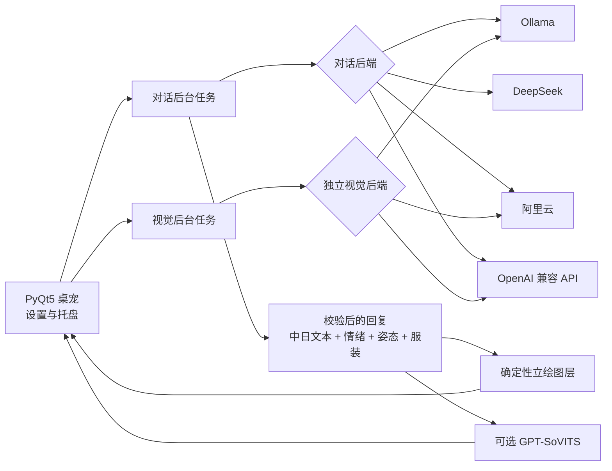

<p align="center">
  
</p>

<h1 align="center">AIpet · 丛雨桌宠</h1>

<p align="center">
  <strong>使用提示词塑造人格，可自由切换本地与云端模型的 AI 桌面伴侣。</strong>
</p>

<p align="center">
  
  
  
  
  
  <a href="../../LICENSE"></a>
</p>

<p align="center">
  <a href="https://github.com/kuxiaowo/AIpet-Murasame/stargazers"></a>
  <a href="https://space.bilibili.com/1067030066"></a>
</p>

<p align="center">
  <a href="../../README.md">English</a> | <strong>简体中文</strong>
</p>

---

## 项目简介

AIpet 是一款面向 Windows 的丛雨 AI 桌宠。它将透明的 PyQt5 角色窗口、
可配置的本地或云端语言模型、可选的屏幕感知、GPT-SoVITS 语音输出以及
faster-whisper 语音输入组合在一起，让丛雨能够在桌面上陪伴、对话并根据
当前场景作出反应。

角色人格由提示词驱动。AIpet 不会在仓库中内置聊天 Transformer、LoRA
适配器或通用 Shell 智能体。模型只负责返回经过验证的角色回复，立绘图层、
文件、窗口、下载任务和子进程仍由程序自身控制。

本项目基于原作
[LemonQu-GIT/MurasamePet](https://github.com/LemonQu-GIT/MurasamePet)
继续开发。演示、部署视频和项目动态会发布在作者的
[哔哩哔哩主页](https://space.bilibili.com/1067030066)。

如果这个项目对你有帮助，或者你也喜欢让丛雨陪在桌面上，请给仓库点一个
[Star ⭐](https://github.com/kuxiaowo/AIpet-Murasame/stargazers)，这会直接支持后续维护。

## 部署方法

当前版本采用源码部署，主要支持 Windows 10 和 Windows 11。

### 1. 准备环境

开始前请安装：

- [Git](https://git-scm.com/)
- [Conda](https://docs.conda.io/) 或 Miniconda
- 通过项目环境安装的 Python 3.10
- 至少一种对话后端：
  - 使用 [Ollama](https://ollama.com/) 运行本地模型；或
  - 使用 DeepSeek、阿里云百炼或 OpenAI 兼容 API

根据要启用的功能，还可以准备：

- NVIDIA 显卡，用于较大的本地 Ollama 或 GPT-SoVITS 工作负载
- 麦克风，用于长按 Caps Lock 进行语音输入
- 7-Zip，用于更快地解压本地 GPT-SoVITS；没有安装时会尝试使用 Windows
  自带的 `tar`
- 已配置好的 AutoDL 实例，用于在云端运行语音合成

如果对话、视觉和 TTS 都使用远程服务，AIpet 本体不要求安装 CUDA。

### 2. 克隆仓库

```bash
git clone https://github.com/kuxiaowo/AIpet-Murasame.git
cd AIpet-Murasame
```

### 3. 创建 Conda 环境

推荐直接使用仓库中的环境文件：

```bash
conda env create -f environment.yml
conda activate aipet
```

也可以手动创建等价环境：

```bash
conda create -n aipet python=3.10 -y
conda activate aipet
python -m pip install -r requirements.txt
```

基础依赖包含桌面界面、配置校验、HTTP、SSH、图像处理和模型接入所需的库，
不会把大型聊天模型或 PyTorch 安装到 AIpet 环境中。

### 4. 准备对话后端

#### 方案 A：本地 Ollama

安装并启动 Ollama 服务，然后拉取一个对话模型。视觉模型不是必需项，只在
启用本地屏幕感知时需要：

```bash
ollama pull qwen3:14b
ollama pull qwen2.5vl:7b
```

默认 Ollama 地址为 `http://127.0.0.1:11434`。设置中的模型字段可以手动
编辑，因此也能使用其他兼容的模型 ID。

#### 方案 B：云端 API

准备 DeepSeek、阿里云百炼或 OpenAI 兼容服务的 API Key。可以在设置窗口
中填写，也可以通过环境变量提供：

```powershell
$env:DEEPSEEK_API_KEY = "your-key"
$env:DASHSCOPE_API_KEY = "your-key"
$env:OPENAI_API_KEY = "your-key"
```

对话与视觉后端互相独立，例如可以同时使用云端对话模型和本地 Ollama
视觉模型。

### 5. 启动 AIpet

```bash
python main.py
```

首次运行会打开“AIpet 初始设置”。至少需要完成以下内容：

1. 在“语言模型”中选择 **Ollama** 或 **云端 API**。
2. 根据所选后端填写服务地址、服务商、API Key 和模型。
3. 在“角色”中设置用户名称并检查人格提示词。
4. 如果可选依赖尚未准备好，先保持屏幕感知、TTS 和语音输入关闭。
5. 保存设置。

保存后，丛雨会作为透明窗口显示在桌面上，同时系统托盘会出现 AIpet 图标。
以后可以随时通过托盘菜单重新打开设置。

启动器不会静默安装依赖或修改 CUDA。Whisper 只会在用户主动点击下载后开始
下载，GPT-SoVITS 资源也必须经过确认才会下载。

### 6. 可选：Caps Lock 语音输入

安装录音与 faster-whisper 依赖：

```bash
python -m pip install -r requirements-voice.txt
```

然后进入“设置 → 拓展功能”，启用语音输入，选择模型目录和录音设备。如果
模型尚不存在，可以在界面中手动下载。

### 7. 从旧版本升级

从旧 V1.3.2 架构升级前，建议备份：

```text
config.json
data/history.json
reference_voices/
GPT-SoVITS/
```

重构后的程序会把用户数据保存到仓库之外，并使用新的设置结构。旧版本的所有
配置字段和历史记录格式尚未全部自动迁移，因此目前最稳妥的方法是备份数据后，
重新检查并保存一次设置。

## 功能介绍

### 本地与云端对话

| 用途 | 服务商 | 默认模型 |
|---|---|---|
| 对话 | Ollama | `qwen3:14b` |
| 对话 | DeepSeek | `deepseek-v4-flash` |
| 对话 | 阿里云百炼 | `qwen-plus` |
| 对话 | OpenAI 兼容 API | `gpt-5.6-luna` |
| 视觉 | Ollama | `qwen2.5vl:7b` |
| 视觉 | 阿里云百炼 | `qwen3-vl-plus` |
| 视觉 | OpenAI 兼容 API | `gpt-5.6-luna` |

模型名称、服务地址、超时时间和 Ollama 上下文窗口都可以在设置中修改。
AIpet 会从 Ollama 的 `GET /api/tags` 或服务商的 OpenAI 兼容
`GET /models` 接口读取模型列表，同时保留手动输入自定义 ID 的能力。

角色回复会使用经过验证的 JSON，内容包括：

- 一至三句简体中文显示文本
- 对应的日语 TTS 文本
- 六种支持的情绪之一
- `a` 或 `b` 立绘姿态
- 四种服装之一

空白、格式错误或超出允许范围的模型输出会被拒绝，不会直接传入界面。

### 桌面交互与可靠置顶

桌宠窗口透明、无边框，不显示在常规任务栏中，并保持在普通窗口上方。在
Windows 上，AIpet 除了使用 Qt 置顶标志，还会通过原生、非激活式的
`SetWindowPos(HWND_TOPMOST)` 看门狗重新确认窗口层级。窗口状态改变后以及
每两秒都会检查一次，不移动窗口，也不会抢夺键盘焦点。

| 操作 | 控制方式 |
|---|---|
| 输入消息 | 左键单击角色下半部分，输入文字后按 Enter |
| 取消输入 | 按 Escape |
| 摸头 | 在头部按住鼠标左键并横向移动 |
| 移动桌宠 | 按住鼠标中键拖动 |
| 语音对话 | 启用语音输入后，长按 Caps Lock 两秒 |
| 设置、视觉、免打扰、记忆、退出 | 使用系统托盘菜单 |

将桌宠拖到另一台显示器后，程序会更新所选屏幕，并根据新屏幕的可用高度调整
立绘尺寸。

### 人格、立绘与换装

“角色”页面可以配置：

- 用户名称
- 两套立绘姿态
- 睡衣、粉白便服、校服和紫色和服
- 可视化人格提示词编辑器
- UTF-8 文本或 Markdown 人格文件导入

模型只能选择经过校验的姿态、情绪和服装名称，再由 AIpet 映射到固定立绘图层。
因此，更换模型服务商也不能随意生成图层编号或破坏立绘组合。

### 屏幕感知

屏幕视觉默认关闭。启用后：

1. Qt 在界面线程中截取所选显示器。
2. 本地先丢弃近似相同的画面。
3. 后台任务只把有意义的变化发送给所选视觉后端。
4. 分析结果通过校验并生成摘要后，才能触发角色反应。

视觉后端与对话后端可以分别配置。AIpet 会把屏幕中的丛雨视为自己的桌面图像，
而不是另一个说话者。原始截图属于临时文件，不会写入对话历史。

### 对话记忆与自动行为

AIpet 会持久化有限的对话历史和简短的屏幕事件摘要。程序最多保留 12 条重要
屏幕事件，移除连续重复内容，并在字符预算内最多注入最近 8 条事件。

自动行为包括：

- 可配置的安静或思考提醒
- 离开提醒
- 用户返回后的欢迎反应
- 避免频繁主动打扰的共享冷却时间
- 可以持久保存的免打扰模式

“其他”设置页提供“清除历史记录”和“清除缓存”按钮，执行前都会要求确认。

### 本地 GPT-SoVITS 语音输出

语音合成使用
[RVC-Boss/GPT-SoVITS](https://github.com/RVC-Boss/GPT-SoVITS)
的 API 格式，默认接口为：

```text
http://127.0.0.1:9880/tts
```

进入“设置 → 拓展功能”，启用 TTS 并选择“本地计算机”，然后配置：

- GPT-SoVITS 引擎目录
- 丛雨语音模型目录
- 请求超时时间

如果资源缺失，AIpet 可以在用户确认后下载引擎包、角色 GPT 与 SoVITS 权重，
以及六种情绪参考音频。下载支持断点续传，并显示准备、传输、校验、解压、安装
和清理进度。用户填写的目录就是实际安装位置，程序不会静默改到其他目录。

参考音频目录结构如下：

```text
Murasame_SoVITS/
└── reference_voices/
    ├── 平静/
    ├── 高兴/
    ├── 害羞/
    ├── 生气/
    ├── 惊讶/
    └── 着急/
```

每个情绪目录需要包含 `asr.txt`，以及 WAV、MP3 或 FLAC 格式的参考音频。
如果本地服务没有运行，AIpet 会使用引擎自带的 Python 启动 `api_v2.py`，
等待接口就绪，加载所选权重后再合成语音。退出时只会停止由 AIpet 自己启动的
进程。

TTS 出错不会丢弃语言模型的完整回答：文字仍会显示，语音错误会通过托盘提示。

### AutoDL 云端 TTS

AutoDL 模式把 GPT-SoVITS 的计算放到远程实例：

1. 启动已经配置好的 AutoDL 实例。
2. 复制登录命令，例如 `ssh -p 12345 root@connect.example.com`。
3. 打开“设置 → 拓展功能”，启用 TTS 并选择“AutoDL 云端”。
4. 粘贴 SSH 命令和密码。
5. 使用预制镜像时，远程命令保持为 `bash -lc 'bash run.sh; bash'`。
6. 设置远程参考音频根目录，通常为 `/root/reference_voices`。
7. 保存后手动启动服务，或直接请求语音。

AIpet 会创建一个 Paramiko SSH 会话，运行远程前台命令，把本地
`127.0.0.1:9880` 转发到远程 `9880` 端口，并通过同一个 SFTP 会话读取
参考音频信息。密码不会出现在命令行中，并使用当前 Windows 用户的 DPAPI
加密保存。

AutoDL 实例必须已经处于运行状态。远程 `run.sh` 需要让 GPT-SoVITS API
监听远程 `127.0.0.1:9880`，同时本地 `9880` 端口必须空闲。

### 语音输入

安装可选语音依赖后，长按 Caps Lock 两秒会开始录音；松开按键后，程序会将
音频交给 faster-whisper，并把识别结果作为用户消息发送。

用户可以选择：

- 由 AIpet 管理的 faster-whisper 模型，或自定义本地模型目录
- CUDA、CPU 或自动设备选择
- 系统默认麦克风，或指定的输入设备

临时录音会在识别完成或失败后删除。

### 可视化设置

设置窗口支持简体中文和英文：

- **语言模型**：对话模式、服务商、地址、模型、超时和模型列表读取
- **拓展功能**：屏幕视觉、GPT-SoVITS、AutoDL、faster-whisper 和输入设备
- **角色**：用户名称、立绘、服装和人格提示词
- **自动行为**：空闲阈值、历史大小和免打扰
- **显示**：显示器、立绘比例和实时诊断命令行
- **其他**：清除历史记录和清除缓存

### 数据、隐私与缓存

Windows 上的用户状态保存在：

```text
%APPDATA%\AIpet-Murasame\
├── config.json
├── history.json
├── screen_memory.json
└── personality.txt
```

可丢弃的运行数据保存在：

```text
%LOCALAPPDATA%\AIpet-Murasame\cache\
├── screens/
├── voices/
├── recordings/
└── logs/
```

“清除缓存”会删除临时截图、合成语音和录音，但保留设置、历史记录、模型和日志。
截图、合成语音和录音在正常处理完成或失败后也会主动清理；如果进程异常中断，
遗留缓存可以通过“其他”页面手动删除。

在设置中填写的 API Key 会保存在用户配置中。如需让密钥与配置文件进一步分离，
可以把输入框留空并使用环境变量。日志会对已识别的密钥字段脱敏，并把大型
Base64 媒体替换成长度与 SHA-256 摘要。

### 诊断与日志

在“显示”页面启用“打开实时诊断命令行”，可以查看：

- 带关联 ID 的模型请求和响应
- 后台任务生命周期事件
- 下载与 TTS 阶段
- 警告和未捕获异常

UTF-8 应用日志按日期保存在 `%APPDATA%\AIpet-Murasame\logs`。
GPT-SoVITS 子进程使用运行缓存中的独立服务日志。

## 架构



## 开发与测试

在 Conda 环境中运行完整测试：

```powershell
$env:QT_QPA_PLATFORM = "offscreen"
python -m unittest discover -s tests -v
```

主要模块：

```text
classes/
├── murasame_class.py    # Qt 交互、播放、空闲和屏幕事件
├── workers.py           # 对话与视觉后台任务
└── download_manager.py  # 可断点续传的模型和引擎下载
tool/
├── backends.py          # Ollama 与云端 API 适配器
├── config.py            # 配置校验和用户路径
├── storage.py           # 对话与屏幕记忆
├── tts.py               # GPT-SoVITS 客户端
├── tts_service.py       # 本地与 AutoDL 服务生命周期
├── windowing.py         # Windows 原生置顶支持
└── runtime_logging.py   # 结构化诊断日志
ui/
└── settings_dialog.py   # 双语可视化设置
```

## 已知限制

- 桌面行为目前主要针对 Windows 设计和测试。
- 置顶看门狗可以改善窗口化和无边框游戏中的表现，但独占全屏或受反作弊保护的
  画面仍可能覆盖桌宠。
- HTTP 取消采用协作方式：被中断的请求可能仍会在后台结束，但过期结果会被忽略。
- 本地模型、TTS 和视觉功能的速度取决于所选模型与硬件。
- 角色立绘和语音素材的使用条款可能与源代码许可证不同。

## 致谢、许可证与素材声明

- 原作桌宠项目：
  [LemonQu-GIT/MurasamePet](https://github.com/LemonQu-GIT/MurasamePet)
- 语音合成项目：
  [RVC-Boss/GPT-SoVITS](https://github.com/RVC-Boss/GPT-SoVITS)
- 视频教程与项目动态：
  [哔哩哔哩主页](https://space.bilibili.com/1067030066)

源代码依据
[GNU Affero General Public License v3.0](../../LICENSE)
发布。

本项目是用于学习与技术交流的非官方同人项目。丛雨以及项目包含的第三方立绘、
语音和其他相关素材，其权利归 YUZUSOFT 等各自权利人所有，不因 AGPL 源代码
许可证而被重新授权。未经许可，请勿将这些素材用于商业用途。
